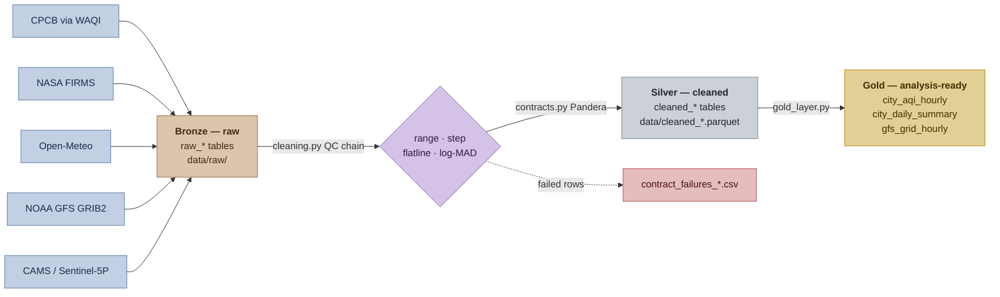

# Real-Time Environmental Data Pipeline

A real-time environmental data pipeline for India. It fetches air quality, weather,
forecast, satellite and active-fire data, runs a shared quality-control chain over it,
and lands it in a medallion architecture (raw → cleaned → gold) backed by SQLite and a
Parquet data lake.

## Quick start

```bash
pip install -r requirements.txt     # deps (GFS also needs the ecCodes system library)
python db.py                        # create env_data.db from schema.sql
printf 'WAQI_TOKEN=...\nFIRMS_MAP_KEY=...\n' > .env
python scheduler.py                 # run everything
```

Keep the checkout **out of OneDrive** — see [Location](#1-location). Without API keys
the CPCB and FIRMS jobs log a clean failure and skip; the other four still run.

To verify a single source instead of the whole pipeline:

```bash
python fetch_weather.py             # no API key needed
python monitor_health.py            # per-source freshness report
```

## How data flows



Nothing is discarded along the way: raw payloads stay verbatim, QC failures are
*flagged* rather than deleted, and gold is derived output that is rebuilt every run.

## Architecture

Five fetchers plus a gold-layer build, orchestrated by `scheduler.py`:

| Job | Module | Source | Cadence |
|---|---|---|---|
| CPCB Air Quality | `fetch_cpcb.py` | CPCB via WAQI | every 15 min |
| FIRMS Active Fires | `fetch_firms.py` | NASA FIRMS (VIIRS + MODIS) | every 20 min |
| Open-Meteo Weather | `fetch_weather.py` | Open-Meteo | every 60 min |
| Medallion Gold Layer | `gold_layer.py` | derived from cleaned data | every 60 min |
| GFS Grid Weather | `fetch_gfs.py` | NOAA NOMADS GRIB2 | 00/06/12/18 UTC + 30 min |
| Sentinel-5P TROPOMI | `fetch_sentinel5p.py` | CAMS via Open-Meteo | daily, 12:00 UTC |

Note on naming: the `imd` tables hold **Open-Meteo** data, not Indian government IMD
data — the real IMD API requires IP whitelisting. Likewise, Sentinel-5P rows come from
the CAMS/Open-Meteo composite rather than direct TROPOMI L2 granules.

### Medallion layers

- **Bronze / raw** — `raw_*` tables and `data/raw/<source>/date=…/`. Original payloads,
  preserved verbatim for auditability.
- **Silver / cleaned** — `cleaned_*` tables and `data/cleaned_<source>/*.parquet`.
  QC-flagged values; nothing is discarded.
- **Gold** — `data/gold/`. Analysis-ready features, rebuilt on every run and never
  primary storage:
  - `city_aqi_hourly/date=YYYY-MM-DD.parquet` — hourly city AQI (India CPCB breakpoints)
  - `gfs_grid_hourly/cycle=<cycle>.parquet` — hourly GFS grid aggregates
  - `city_daily_summary/date=YYYY-MM-DD.parquet` — daily pollutants **left-joined** with
    daily weather on the case-folded city name

#### Sample gold output

Real rows the pipeline produced, abridged to the columns that matter most.

**`city_aqi_hourly`** — `aqi_category` is derived from the aggregated `aqi_max`,
so the two can never disagree:

| city | pm25_mean | aqi_max | aqi_category | n_stations |
|---|---|---|---|---|
| delhi | 112.0 | 112.0 | Moderate | 1 |

Also carries `hour_bucket`, `pm10_mean`, `no2_mean` and `computed_at`.

**`city_daily_summary`** — pollutants left-joined with weather. `wind_dir_daily_mean`
is a circular mean, and `n_weather_obs` shows how many weather rows backed the join
(null for a city with no matching station):

| city | daily_aqi | daily_aqi_category | temp_daily_mean | wind_dir_daily_mean | n_weather_obs |
|---|---|---|---|---|---|
| delhi | 97.0 | Satisfactory | 28.32 | 106.4 | 5 |

The weather columns are null on any city-day the join finds no matching station,
which is the LEFT join doing its job rather than a fault — a CPCB observation
timestamped just past midnight UTC will sit in a date partition the weather side
has not reached yet.

Also carries the six `*_daily_mean` pollutant columns, `humidity_daily_mean`,
`rainfall_daily_total`, `temp_daily_max/min`, `wind_speed_daily_mean` and `n_obs`.

**`gfs_grid_hourly`** — one row per cycle and valid time over the India bounding box:

| cycle | temp_mean | temp_max | precip_total | n_grid_points |
|---|---|---|---|---|
| 20260914_00z | 20.74 | 33.23 | *null* | 14625 |

Also carries `valid_time`, `temp_min` and `wind_speed_mean`.

`precip_total` is null on every cycle, and that is the honest answer: the scheduled
fetcher only requests forecast hour 000, which carries no accumulation. It used to
read `0.0`, which is the same claim a genuinely rainless day would make.

### Supporting modules

| Module | Role |
|---|---|
| `cleaning.py` | Shared QC chain (range, step, flatline, log-MAD) |
| `contracts.py` | Pandera data contracts; violations logged to `contract_failures_<source>.csv` |
| `storage.py` | Parquet data lake, read-merge-write with atomic rename |
| `db.py` | Connection + schema management, SQLite or Postgres |
| `run_logger.py` | Writes `pipeline_run_log` rows from any execution context |
| `monitor_health.py` | Per-source freshness and success/failure report |

## Setup

### 1. Location

Keep the checkout **outside OneDrive** (or any sync client). OneDrive locks
`env_data.db` and the `data/*.parquet` files mid-write, producing
`database is locked` and `PermissionError` on the atomic Parquet rename. A plain local
path such as `D:\DataPipeline` is fine.

Paths inside the pipeline resolve against the module directory, not the caller's
working directory, so scripts work when launched from anywhere.

### 2. Dependencies

```bash
pip install -r requirements.txt
```

`cfgrib` and `xarray` need the `ecCodes` system library to parse GFS GRIB2
(`sudo apt-get install libeccodes0`, or `conda install -c conda-forge eccodes`).

### 3. Database

SQLite is the default and needs no server — the file is created for you:

```bash
python db.py
```

For PostgreSQL instead, set `DB_ENGINE=postgres` plus the `DB_*` variables in `.env`.
`db.py` translates placeholders and conflict clauses between the two dialects.

### 4. API keys

Create a `.env` in the repo root:

```
WAQI_TOKEN=your_waqi_token_here
FIRMS_MAP_KEY=your_firms_map_key_here
```

- **WAQI Token** — CPCB air quality. [aqicn.org/data-platform/token](https://aqicn.org/data-platform/token/)
- **FIRMS MAP_KEY** — NASA active fire. [firms.modaps.eosdis.nasa.gov/api](https://firms.modaps.eosdis.nasa.gov/api/)

GFS, Open-Meteo and CAMS need no keys. Missing or placeholder keys make the affected
fetcher log a clean failure and skip — the pipeline does not crash. `.env` is gitignored.

### 5. Running

See [Quick start](#quick-start) for the short version. Any fetcher runs standalone and
logs its own `pipeline_run_log` row:

```bash
python fetch_cpcb.py
```

The full orchestration in the foreground — Ctrl+C to stop:

```bash
python scheduler.py
```

To leave it running unattended, register it as a background task instead (next section).

## Running as a Windows background task

```powershell
powershell -ExecutionPolicy Bypass -File .\setup_background_task.ps1
```

Registers `DataPipelineScheduler` to start at logon and run indefinitely. Two details
matter, both learned the hard way:

- **It runs headless under `pythonw.exe`.** `python.exe` allocates a console, and the
  logon sequence tears that console down moments later, killing the scheduler with
  `0xC000013A` (`STATUS_CONTROL_C_EXIT`) before it writes a single log line. `pythonw`
  has no console, so nothing can close it. Logging is unaffected: `scheduler.py` always
  writes `scheduler.log` via a `FileHandler`, and attaches a console handler only when a
  real stream exists.
- **`ExecutionTimeLimit` is 0 (unlimited).** The default is `PT72H`, which is why a
  long-running task appears to "disappear" after exactly three days.

Tasks register at `RunLevel Limited` — the pipeline only makes HTTP calls and writes
inside the repo. Re-registering a task that was first created from an elevated shell
requires an elevated shell again, because its task file is owned by Administrators.

### Health monitoring

```powershell
powershell -ExecutionPolicy Bypass -File .\setup_monitor_task.ps1
```

Registers `DataPipelineSchedulerMonitor` to run `check_task_alive.ps1` every 30 minutes.
For a continuously-running scheduler only the `Running` state counts as alive — `Ready`
means the process has exited. Alerts append to `task_health.log` and a file on the
Desktop. Pass `-AutoRestart` to have the probe restart a dead scheduler instead of only
recording it.

For a point-in-time view of every source:

```bash
python monitor_health.py
```

## Historical backfill

The live fetchers only reach near-real-time feeds, so the pipeline holds nothing
from before the day it started. Two scripts load history instead, both defaulting
to the same window — January, October, November and December of 2020–2025 —
so fire and weather line up and can actually be compared.

### Fire — `backfill_firms.py`

FIRMS NRT spans roughly the last two months, so historical fire data needs the
Standard Processing (SP) archives:

```bash
python backfill_firms.py --months 1 2 3 4 5 6 7 8 9 10 11 12   # what is loaded
python backfill_firms.py                       # default: Jan/Oct/Nov/Dec only
python backfill_firms.py --years 2023 2024     # specific years
python backfill_firms.py --months 10 11        # specific months
python backfill_firms.py --dry-run             # print the plan, fetch nothing
```

The default window is January, October, November and December of 2020-2025 — the
months that matter for stubble burning and winter pollution. `--sources` selects
the sensors; the default pair mirrors the live fetcher.

| Source | Archive coverage | Resolution |
|---|---|---|
| `VIIRS_SNPP_SP` | 2012-01-20 onward | 375 m |
| `MODIS_SP` | 2000-11-01 onward | 1 km |
| `VIIRS_NOAA20_SP` | 2018-04-01 onward | 375 m |

Availability is checked against the FIRMS `data_availability` endpoint before any
month is requested, so a period the archive cannot serve is skipped up front rather
than failing mid-run.

Three things differ from the live fetcher, deliberately:

- **The area API caps `day_range` at 5**, not 10. Each month is split into chunks
  that cover the tail as well, so a 31-day month ends with a single-day chunk
  rather than losing the 31st.
- **Parquet partitions by observation date**, not fetch date, so historical rows
  land in the partition they belong to.
- **Rows are written with `executemany`.** One month of VIIRS runs to tens of
  thousands of detections; the live fetcher's per-row loop does not keep up.

Re-running is safe. Inserts are idempotent on the same keys the live fetcher uses
and Parquet partitions are read-merge-written, so an interrupted run can simply be
started again.

Measured on January 2020: 42,502 rows in 50 seconds, zero contract failures, full
month coverage. Burning-season months run several times larger — November 2020
returned 113,659 rows against January's 42,502.

Rate limits are worth a glance before a large run; the MAP_KEY status endpoint
reports the current budget:

```bash
curl "https://firms.modaps.eosdis.nasa.gov/mapserver/mapkey_status/?MAP_KEY=$FIRMS_MAP_KEY"
```

### Weather — `backfill_weather.py`

Open-Meteo's reanalysis archive reaches back to 1940 and needs no API key:

```bash
python backfill_weather.py --months 1 2 3 4 5 6 7 8 9 10 11 12  # what is loaded
python backfill_weather.py                     # default: Jan/Oct/Nov/Dec only
python backfill_weather.py --years 2023 2024
python backfill_weather.py --dry-run
```

It polls the same 13 stations as `fetch_weather.py` and applies the same QC
thresholds, including the circular check on wind direction.

**`wind_speed_unit=ms` is not optional.** Open-Meteo returns km/h by default while
the live fetcher asks for m/s. Mixing the two in one column would corrupt any
analysis spanning live and backfilled rows without ever raising an error.

Contiguous months collapse into a single request, so October–December is one span
rather than three: 132 requests against the 324 the FIRMS backfill needs, because
the archive endpoint takes a date range where the FIRMS area API caps at five days.

Measured on the full twelve-month window: 683,904 rows in about seven minutes,
zero contract failures — 13 stations × 2,192 days × 24 hours. Requests stay cheap
because contiguous months collapse: twelve months is one span per year, 78 requests
where the FIRMS backfill needs 948.

### Air quality — `backfill_airquality.py`

```bash
python backfill_airquality.py                  # Oct 2022 onward, 8 cities
python backfill_airquality.py --cities delhi amritsar
python backfill_airquality.py --dry-run
```

Two things to know before using what it writes.

**It is not CPCB ground-station data.** CPCB observations are not available
historically through any free interface — the WAQI API behind `fetch_cpcb.py`
serves the current observation only, and CPCB's own archive is not openly
published. This loads the CAMS atmospheric composition reanalysis via Open-Meteo
instead: a model product, not a measurement.

**Coverage starts 2022-08-03.** Earlier dates return rows of nulls rather than an
error, so the floor is enforced in the script. The fire and weather backfills cover
2020 onward; this can only reach August 2022, so roughly the last three and a half
years of that span. 239,192 rows across 8 cities, zero contract failures beyond 40
negative concentrations the contract correctly rejected.

Rows go to `cleaned_cams_aq`, deliberately not to `cleaned_cpcb`, because the two
hold different quantities: WAQI gives AQI sub-indices, CAMS gives concentrations.
Units are CAMS's own throughout — µg/m³ including CO, where CPCB quotes mg/m³, so
divide by 1000 before comparing.

## Sharing GFS — `export_gfs_parquet.py`

`cleaned_gfs` is wide: one column per variable, each in a different unit, with no
room to say which. This writes the long form to a single Parquet file, one row per
grid point per variable, with `value` and `unit` adjacent:

```bash
python export_gfs_parquet.py                                  # all of India, long
python export_gfs_parquet.py --format wide --bbox 28.2 28.9 76.8 77.6
python export_gfs_parquet.py --out somewhere/gfs.parquet
```

Two shapes, both carrying the unit:

| `--format` | Shape | Where the unit lives |
|---|---|---|
| `long` (default) | a row per grid point **per variable** | a `unit` column beside `value` |
| `wide` | a row per grid point | the column name — `temperature_c`, `u_wind_ms` |

`long` columns: `valid_time`, `cycle`, `fhr`, `lat`, `lon`, `variable`, `value`,
`value_raw`, `unit`, `qc_flag`, `imputed`, `source`, `is_synthetic`, `fetched_at`.

`wide` columns: `valid_time`, `cycle`, `fhr`, `lat`, `lon`, then per variable
`<name>_<unit>`, `<name>_<unit>_raw`, `<name>_qc_flag`, `<name>_imputed`, then
`source`, `is_synthetic`, `fetched_at`.

**`temperature_c`, not `temperature_k`.** GFS ships TMP in Kelvin; `fetch_gfs.py`
subtracts 273.15 at parse time, so the stored value is Celsius and the name says so.
In `wide`, `valid_time` and `fetched_at` are ISO-8601 **text** with an explicit
`+00:00` rather than Parquet timestamps, so no reader can quietly localise them.

The unit map, the GRIB field each variable came from, the grid description and the
caveats below are also written to the Parquet key-value metadata, so a consumer who
never reads this file still gets them:

```python
import pyarrow.parquet as pq, json
json.loads(pq.ParquetFile("data/exports/cleaned_gfs.parquet").schema_arrow.metadata[b"units"])
# {'temperature': 'degC', 'u_wind': 'm s-1', 'v_wind': 'm s-1'}
```

Two things are withheld by default, because both look like data and are not:

- **Synthetic rows.** When NOMADS has not published a cycle, `fetch_gfs.py` writes a
  constant grid (25 °C, 1 m/s, 0 mm) tagged `is_synthetic`. `--include-synthetic`
  keeps them.
- **Precipitation.** Every APCP value in the table is exactly `0.0`.
  `--include-precipitation` forces the column in anyway.

### Why precipitation is all zeros

Two independent faults, either of which alone is sufficient:

1. **`fetch_gfs.py` requests forecast hour 000.** APCP is an accumulation over an
   interval, so there is nothing to accumulate at f000 and NOMADS omits the field
   entirely. The fetcher then falls back to `[0.0] * len(temps)` — a dry grid, not a
   missing one. Verified by probing the same cycle at both hours: f000 returns
   `TMP, UGRD, VGRD`; f003 returns those plus `APCP`.
2. **GRIB2 scale factors are sign-magnitude, and the parser read two's complement.**
   APCP is packed with a binary scale of −4, written `0x8004`. Read as two's
   complement that is −32764, so `2 ** scale` underflowed to `0.0` and every value
   collapsed onto the reference value regardless of its bits. Temperature and wind
   were unaffected because their scale factors are positive, where both readings
   agree. Decoded correctly, the same payload gives 0–40.9 mm/3h with rain in 52% of
   Indian grid cells.

Fault 2 is fixed (`grib_signed()` in `fetch_gfs.py`, covered by three tests). Fault 1
is not: moving to f003 changes the table from analysis to forecast, which is a
modelling decision, not a bug fix. Until it is made, treat precipitation as absent.

## Forecast runs — `fetch_gfs_forecast.py`

`cleaned_gfs` holds forecast hour 000 and nothing else: `fetch_gfs.py` requests one
file per cycle, so the table is a sequence of analysis hours, not a forecast. There
is no `fhr > 0` in the database to export. This script fetches a whole run — f000 to
f072 at 3-hourly steps — and writes it straight to Parquet:

```bash
python fetch_gfs_forecast.py --bbox 28.2 28.9 76.8 77.6 --out exports/gfs_ncr_forecast.parquet
```

`exports/gfs_ncr_forecast.parquet` is checked in: 9 NCR grid points × 25 steps = 225
rows, same unit-suffixed column names as the extract above plus `precipitation_mm_3h`.
It picks the newest cycle whose f072 is published, or takes `--cycle YYYYMMDDHH`.
Re-running overwrites the file with the same 20-column schema, so a strict consumer
can re-read it without remapping.

### Three ways these files lie to a naive reader

All three are silent — nothing errors, and the output looks reasonable:

**TMP appears twice per file.** Surface skin temperature (fixed-surface type 1) and
2 m air temperature (type 103, level 2). `fetch_gfs.py` keys on the GRIB parameter
alone and lets the last record win, so which one it stores depends on the order NCEP
happened to write them. It gets 2 m today by luck. This script selects on parameter
**and** level.

**APCP appears twice per file, with different windows.** One record is the bucket
since the last 6-hour boundary, the other is the run total since f000. Last-wins takes
the run total — a series that only ever increases, which reads as relentless rain.

**The bucket is not always 3 hours.** At f006, f012, f018 … it spans 6 hours, not 3:

| file | short record | file | short record |
|---|---|---|---|
| f003 | 0–3 h | f006 | 0–6 h |
| f009 | 6–9 h | f012 | 6–12 h |
| f015 | 12–15 h | f018 | 12–18 h |

So the 6-hourly steps are differenced against the 3-hour bucket before them.
`precipitation_mm_3h` is therefore always the accumulation over the **3 hours ending
at `valid_time`**, and f000 is `NULL` with `qc_flag = 'no_accumulation_window'` — the
analysis hour has no interval to have rained in. The QC imputer will happily
interpolate rain into it if you let it; the script puts the null back afterwards.

**The differencing is checked, not assumed.** The run-total record the script
deliberately discards is used at f072 as an independent reconciliation: the 3-hourly
increments must sum back to it at every grid point, within one or two quanta of the
1/16 mm packing — the most that 24 differenced buckets can be expected to close to.
A wider gap aborts the write.

**A dry run is confirmed at the source, not assumed either.** That reconciliation is
vacuous when it rains nowhere: zero sums to zero whatever the decode did, and a
silently zeroed decode is exactly what the sign-magnitude bug looked like. So when
the whole run comes back at 0 mm, the script checks how NCEP packed the field.
`nbits = 0` with a zero reference means the file itself reports no rain; bits present
with every value zero means the decode ate them, and the write is refused. The
committed 21 Sep run is genuinely dry — every APCP field is a packed constant zero,
while the same decoder over all of India on the same cycle finds ~9,000 wet cells and
up to 146 mm off the Bay of Bengal coast.

These rows are **not** inserted into `cleaned_gfs` yet, but the obstacle is gone:
`precipitation_window_h` now exists on both `raw_gfs` and `cleaned_gfs`, so a 3-hour
forecast bucket and a window-less analysis row can live in the same column without
being confused for one another. Wiring the forecast writer into the table is the
remaining step.

### The committed NCR extract

`exports/gfs_ncr.parquet` is checked in — Delhi NCR, `wide`, regenerated with:

```bash
python export_gfs_parquet.py --format wide --bbox 28.2 28.9 76.8 77.6 --out exports/gfs_ncr.parquet
```

That box holds **9 of the 14,625 grid points** (lat 28.25/28.50/28.75, lon
77.00/77.25/77.50). Note what that makes the file: 9 points × the cycles collected so
far. `cleaned_gfs` is a live table with a few days in it, not an archive — at the time
of writing, three cycles of which one is synthetic fallback, so **18 rows**. It grows by
9 rows per real cycle. Everything under `data/` is gitignored; `exports/` is the one
place a deliberately shared extract is tracked.

## Analysis

`analyze_fire_weather.py` joins daily FIRMS detections inside a lat/lon box to one
station's daily weather and reports Pearson and Spearman — pooled, inside the
burning window, and per year — plus a rain-suppression test.

```bash
python analyze_fire_weather.py                            # stubble belt vs Delhi
python analyze_fire_weather.py --station Lucknow
python analyze_fire_weather.py --belt 24 31 74 88 --years 2023 2025
```

It needs both backfills to have run over the same window. Three things decide
whether any number it prints means anything:

- **Pooled figures are confounded by season.** January is cold and quiet, November
  warm and peaking, so a pooled temperature correlation mostly measures the
  calendar. Pooled temperature reads `+0.65` Spearman and collapses to `-0.12`
  inside October–November. Read the burning window.
- **A correlation is only trustworthy if its sign holds across years.** That is what
  the per-year table is for. Rainfall stays negative in every year that had rain
  (−0.28 to −0.55); temperature flips sign three times and is therefore noise.
- **Cloud cover suppresses detections as well as burning.** Rain days are cloudy
  days and the sensor sees less through cloud, so the rain result mixes a real
  effect with an observational artefact. Separating them needs cloud-mask data this
  pipeline does not carry.

Measured inside October and November only, rain looked like the strongest signal in
the data: median 45 detections the day after rain against 318 after a dry day, a
ratio of 0.14 at Delhi and 0.20 at Amritsar. With all twelve months loaded, most of
that turns out to be the calendar. See the deseasonalised figures below.

`reports/burning-season.html` presents all of this as a standalone page: detections
by month year over year, the daily shape of each season, the rain dumbbell across the
three stations, the per-year rank correlations, and the distance-versus-correlation
scatter below. It opens straight in a browser
with no server or build step. The figures are baked in, so it is a snapshot rather
than a live view — the file header records the data state it was built from and which
commands regenerate the numbers.

Amritsar and Patiala sit inside the belt, so the analysis no longer has to lean on
Delhi from 250 km away. Running all three is a useful robustness check rather than a
choice between them: the rain result holds at every station (ratio 0.14 Delhi, 0.20
Amritsar, 0.18 Patiala), which is a stronger claim than any single station makes.

### What survives once the season is subtracted

Everything above is measured inside a four-month window, where the seasonality
caveat can only be flagged. With all twelve months loaded it can be removed: build a
day-of-year climatology, take each day's anomaly from its own normal, and correlate
those. Belt detections against Delhi, 2020–2025, 2,192 days:

| Variable | Raw ρ | Deseasonalised ρ | Retained |
|---|---|---|---|
| humidity | −0.554 | **−0.320** | 58% |
| rainfall | −0.553 | −0.179 | 32% |
| temperature | +0.001 | **+0.157** | — |
| wind speed | +0.040 | +0.107 | — |

Three things change from the four-month reading:

- **Humidity is the real driver, not rainfall.** It keeps 58% of its strength and is
  the most consistent within-month signal, median ρ −0.408 across the twelve months.
- **Rain suppression was mostly seasonal.** A third survives — real, but far less than
  the 0.14/0.20 ratio suggested.
- **Temperature reads +0.001 raw, which looks like nothing.** Two opposing seasonal
  effects cancel. Deseasonalised it is +0.157. A four-month window could not have
  found it, and this repo reported temperature as noise until the full year was loaded.

### Two burning seasons, not one

The four-month window also hid the larger fire season outright. Detections by
calendar month, summed over 2020–2025:

| | Jan | Feb | Mar | Apr | May | Jun | Jul | Aug | Sep | Oct | Nov | Dec |
|---|---|---|---|---|---|---|---|---|---|---|---|---|
| thousands | 327 | 667 | **1,814** | **1,546** | 553 | 115 | 31 | 32 | 46 | 258 | 568 | 349 |

March and April carry 3,359,545 detections, 53% of the total, against October and
November's 826,763 at 13%. Every one of the six years peaks in March or April; none
peaks in November. The stubble season is the one with a name, not the one with the
fire.

### The smoke-transport question, and why the data cannot answer it

With CAMS air quality loaded, the obvious chart is belt fire detections against city
PM2.5. It is in the report, as a negative result. Correlation of daily PM2.5 with
daily belt detections, October and November 2022–2025:

| City | km from belt | Raw ρ | Deseasonalised ρ |
|---|---|---|---|
| lucknow | 650 | +0.384 | +0.065 |
| **mumbai** | **1,302** | **+0.342** | **+0.124** |
| bengaluru | 1,958 | +0.340 | −0.016 |
| delhi | 253 | +0.320 | +0.064 |
| kolkata | 1,532 | +0.301 | −0.040 |
| patiala | 63 *(in belt)* | +0.287 | −0.004 |
| amritsar | 151 *(in belt)* | +0.223 | −0.012 |
| chennai | 1,992 | +0.109 | −0.013 |

Smoke transport cannot produce that ordering. Mumbai, 1,302 km away, correlates as
strongly as anything inside the belt, and Bengaluru at 1,958 km nearly matches Delhi.
The deseasonalised column settles it: **every city collapses toward zero**, the two
inside the belt to −0.004 and −0.012. The entire apparent relationship was the shared
calendar. Mumbai was the control that gave it away; deseasonalising is the proof.

There is a second, independent reason the number cannot carry weight. CAMS is fed by
the Global Fire Assimilation System, which assimilates **MODIS and VIIRS active-fire
observations** — the same two sensors supplying the detection counts on the other axis.
The model was told where the fires were, so the correlation is partly circular by
construction, whatever the geography says.

Answering the transport question properly needs ground-measured PM2.5, which this
pipeline does not have historically, plus transport modelling it does not do.

## Data quality control

- **Real pollution spikes are preserved.** Flagged readings are never deleted or set to
  NaN; raw values survive in full so downstream models can analyse genuine events.
- **Multi-stage QC chain:**
  1. **Range (`range_fail`)** — physically impossible readings (PM2.5 outside 0–1000 µg/m³).
  2. **Step (`step_fail`)** — implausible jumps against the prior reading at the same
     station. Uses circular difference arithmetic for `wind_dir`.
  3. **Flatline (`flatline`)** — identical values for 12+ consecutive hours (stuck
     sensors). Consecutive zeros are ignored for rainfall, since dry spells are real.
  4. **Log-space MAD (`mad_outlier`)** — optional skew-robust outlier detection in
     `log(x + 1)` space using Median Absolute Deviation.
- **QC flags** are comma-separated: `"ok"`, or `"range_fail,step_fail"`.
- **NaN-only imputation** — temporal and spatial KNN interpolation touches *only*
  originally missing values.
- **GFS timestamps** — records carry `valid_time` (cycle start + `fhr`) separately from
  `fetched_at` (download audit time), enabling exact temporal deduplication.
- **Data contracts** — every cleaned frame is validated against a Pandera schema before
  it lands. Failing rows are dropped from the batch and written to
  `contract_failures_<source>.csv` rather than silently polluting training data.

### Aggregation rules worth knowing

- **AQI category is derived from the aggregate it labels.** `aqi_category` is computed
  from the aggregated `aqi_max`, not reduced from per-station categories — a mode over
  per-station labels can contradict the max it sits beside.
- **A precipitation number without its accumulation window is unreadable.**
  `cleaned_gfs.precipitation_window_h` says how many hours the value covers. GFS
  APCP is a bucket, not a rate, and the bucket length varies with forecast hour —
  3 h at f003/f009/f015, 6 h at f006/f012/f018 — so two rows are not comparable
  until you have read it. `NULL` means there is no window and the precipitation
  columns hold no measurement, with `precipitation_qc_flag =
  'no_accumulation_window'` saying so. Every f000 row is in that state: the
  analysis hour has no interval to accumulate over.
- **A seasonal confound cannot be flagged away, only subtracted.** Fire, temperature,
  humidity and urban PM2.5 all follow the calendar, so raw correlations between them
  largely measure the time of year. Deseasonalising needs complete years: with a
  four-month window the climatology cannot be built, and the pooled number is all you
  have. Load every month before trusting any correlation in this repo.
- **AQI is computed on the scale the row is actually on.** WAQI's `iaqi` values,
  which feed `cleaned_cpcb`, are already AQI sub-indices on the 0–500 scale — the
  API's overall `aqi` equals `iaqi[dominentpol]` exactly, which is how you can tell.
  Pushing one of those through the CPCB concentration breakpoints a second time
  inflates it badly: a reported pm25 of 112 becomes AQI 273.6 ("Poor") when the
  correct answer is 112 ("Moderate"). Rows that genuinely hold µg/m³ do need the
  breakpoints, so `gold_layer` decides per row from `source`.
- **Wind direction averages circularly.** The daily mean bearing uses a vector mean; an
  arithmetic mean of 350° and 10° gives 180° (due south) when the answer is 0° (north).
- **The daily summary join is a LEFT join.** A city with pollution data but no matching
  weather station keeps its row with null weather columns instead of vanishing. The
  weather column set is fixed, so the output schema is stable whether or not weather
  data was available.

## Idempotency

Every table has a uniqueness constraint and every insert is `INSERT OR IGNORE`
(translated to `ON CONFLICT DO NOTHING` for Postgres), so re-running a fetcher never
duplicates rows:

| Table | Unique on |
|---|---|
| `raw_cpcb`, `raw_imd`, `raw_firms` | `(timestamp, raw_data_hash)` |
| `raw_gfs`, `cleaned_gfs` | `(lat, lon, cycle, fhr)` |
| `cleaned_cpcb` | `(station_id, timestamp)` |
| `cleaned_imd` | `(station, timestamp)` |
| `cleaned_firms` | `(lat, lon, timestamp, satellite)` |
| `raw_sentinel5p`, `cleaned_sentinel5p` | `(lat, lon, timestamp)` |

Parquet writes use read-merge-write with the same dedup keys, then an atomic rename.

## Tests

```bash
python -m unittest test_cleaning test_idempotency
```

37 tests: the QC chain, the gold AQI scale rules, GRIB2 scale-factor decoding and
APCP bucket differencing including the dry-run guard (`test_cleaning.py`), and database idempotency including GFS `valid_time` computation
and the precipitation window column (`test_idempotency.py`). The idempotency suite builds its test
database from `schema.sql`, so any table must be declared there to be covered.

## Utility scripts

| Script | Purpose |
|---|---|
| `query_db.py` | Row counts for every table |
| `diagnose_gfs.py` | GFS coverage, cycles and valid times |
| `inspect_firms.py` | FIRMS entries and duplicate check |
| `backfill_firms.py` | Load historical FIRMS fires from the SP archives |
| `backfill_weather.py` | Load historical weather from the Open-Meteo archive |
| `backfill_airquality.py` | Load historical CAMS air quality into `cleaned_cams_aq` |
| `analyze_fire_weather.py` | Correlate belt fire counts against station weather |
| `reports/burning-season.html` | Standalone report page built from the two backfills |
| `normalize_gfs_cycles.py` | Backfill/normalise GFS cycle labels |
| `migrate_precip_window.py` | Add `precipitation_window_h`; clear the f000 zeros that were never measured |
| `migrate_db.py` | Rebuild tables against the current schema |
| `export_gfs_parquet.py` | Export `cleaned_gfs` to one Parquet file with a `unit` column |
| `fetch_gfs_forecast.py` | Fetch a full f000–f072 GFS run, with real 3-hourly precipitation |
| `migrate_sqlite_to_parquet.py` | Export existing SQLite rows into the Parquet lake |

## Known limitations

- **Sleep creates gaps.** APScheduler defaults apply (`misfire_grace_time=1`,
  `coalesce=True`), so runs that come due while the machine sleeps are skipped, not
  backfilled. Raise `misfire_grace_time` on a job if you need catch-up behaviour.
- **`is_synthetic` is row-level, not column-level**, so it cannot express a partial
  fallback where some fields are real and others synthetic.
- **The scheduled GFS job carries no precipitation.** It asks for forecast hour 000,
  where APCP does not exist. That used to be stored as a constant `0.0`; it is now
  `NULL` with `precipitation_window_h` `NULL` and
  `precipitation_qc_flag = 'no_accumulation_window'`, so nothing downstream can read
  it as a dry day. See [Why precipitation is all zeros](#why-precipitation-is-all-zeros).
  `fetch_gfs_forecast.py` gets real precipitation, but writes Parquet rather than
  into the table.
- **`cleaned_gfs` has no forecast hours.** Every row is `fhr = 000`. The `fhr` column
  and the `(lat, lon, cycle, fhr)` unique constraint anticipate more, but nothing
  writes them.
- **`fetch_sentinel5p.py` is not Sentinel-5P.** It queries
  `air-quality-api.open-meteo.com` (CAMS reanalysis, tagged `source='cams_open-meteo'`)
  on a 2° grid — 240 points, none of which fall inside Delhi NCR — and its `_ppb`
  columns hold µg/m³, not ppb. The table name, the file name and the column names all
  misdescribe the contents.
- **WAQI returns stale observation timestamps for some stations**, occasionally months
  old. These are stored at their reported time, so they land in older date partitions
  and will not join against current weather.
